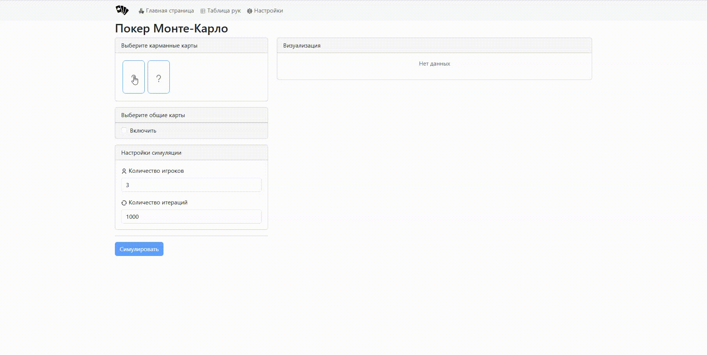

[//]: # (Project logo)
 

    
    <h3 align="center">PokerMonteCarlo</h3>

## 📌 About project
🚧 *Under construction*

## 👀 Demo

## 🛠️ Technology Stack
### Client
- TypeScript – Language
- React - Framework
    - Redux - State Manager
- Vite - Bundler
- Bun - Runtime

### Server
- Go - Language
- Fiber - Framework
- Swagger - Documentation

## 🚀 Getting Started
🚧 *Under construction*

## ✒️ Authors
🚧 *Under construction*

<a href="#readme-top">⬆️ Back To Top</a>
